# Aston Martin DBRS9 CFD Aerodynamics

CFD analysis and aerodynamic optimisation of a 13% scale Aston Martin DBRS9 using STAR-CCM+.

The project investigated drag, lift, downforce, airflow behaviour and aerodynamic balance across multiple vehicle configurations, supported by mesh-independence checks and comparison against wind-tunnel data.

## Key Results

- Final optimised aerodynamic setup achieved approximately **12.2% more downforce**
- Achieved an improved front/rear lift balance of approximately **41/59**
- Closed-cooling configurations reduced drag compared with open-cooling cases
- Disk wheels produced smoother aerodynamic behaviour than spoke wheels
- CFD predictions were compared against physical wind-tunnel measurements
- Mesh-independence and residual-convergence checks were used to assess numerical reliability

## Project Objectives

- Evaluate aerodynamic performance of the DBRS9 scale model
- Compare drag and lift across different configurations
- Assess the effect of cooling duct configuration
- Compare spoke and disk wheel designs
- Investigate supporting-strut influence
- Validate CFD predictions against experimental wind-tunnel data
- Optimise rear-wing positioning for improved downforce and lift balance
- Visualise wake behaviour, streamlines, vortices and pressure distribution

## Simulation Setup

- Software: STAR-CCM+
- Model scale: 13%
- Inlet velocity: 40 m/s
- Yaw angle: 0°
- Air density: 1.18415 kg/m³
- Polyhedral volume mesh
- Prism-layer near-wall mesh
- Turbulence modelling with K-Epsilon / refined turbulence setup
- Symmetry condition used to reduce computational cost

## Mesh Independence

A mesh-independence study was performed using progressively refined meshes and prism-layer adjustments.

The analysis showed reduced variation between refined cases, supporting confidence in the CFD solution.
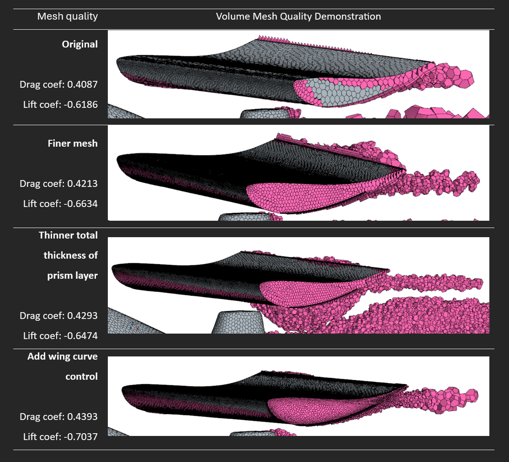

## Experimental Wind-Tunnel Setup

Physical wind-tunnel testing was used as a reference for comparison with the CFD predictions.

The 13% scale Aston Martin DBRS9 model was tested under controlled conditions, allowing the numerical drag and lift results to be compared against experimental measurements.

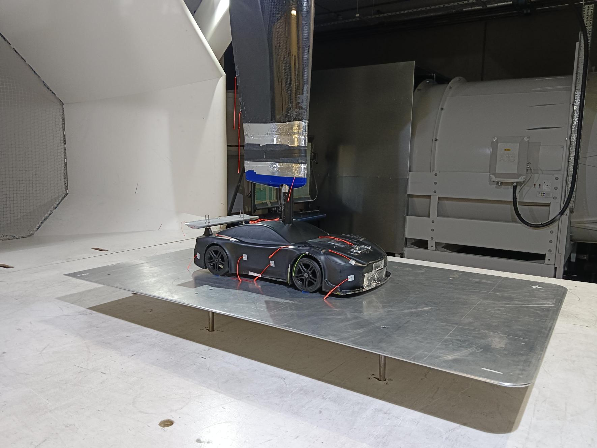

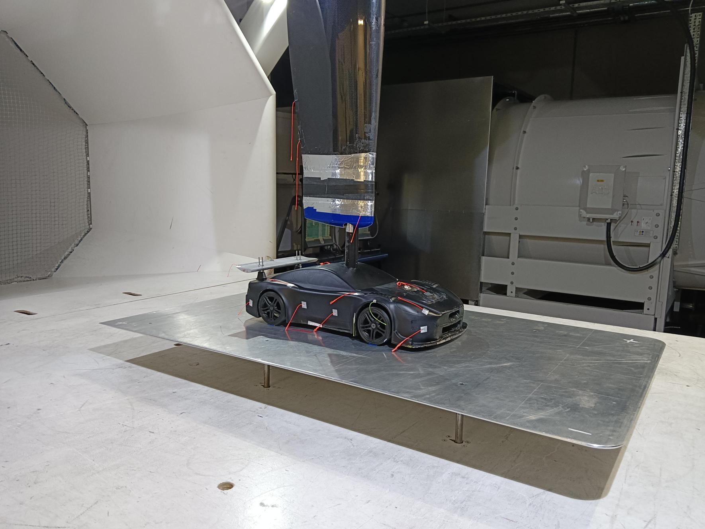

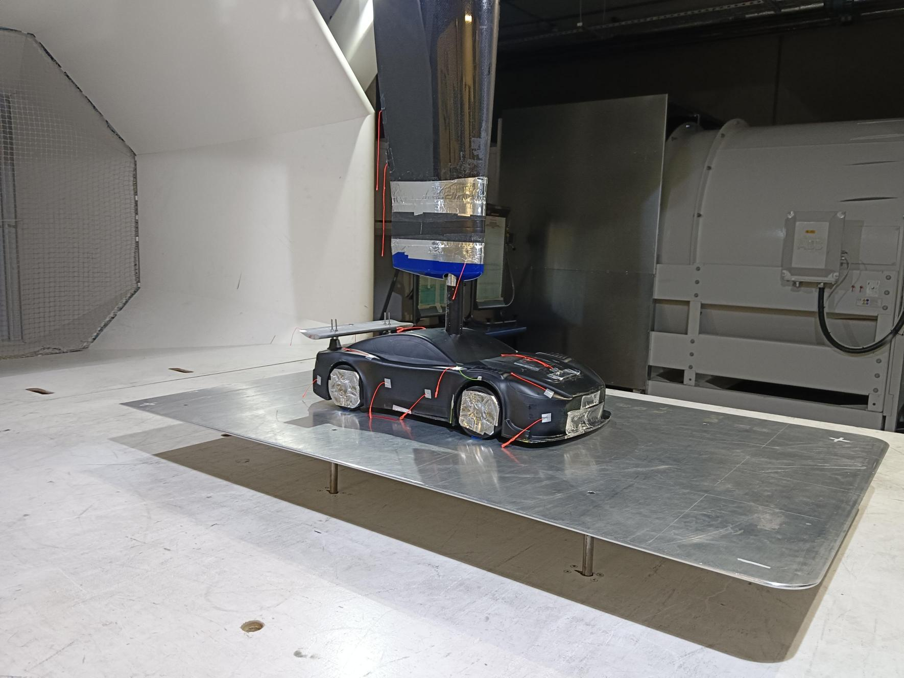

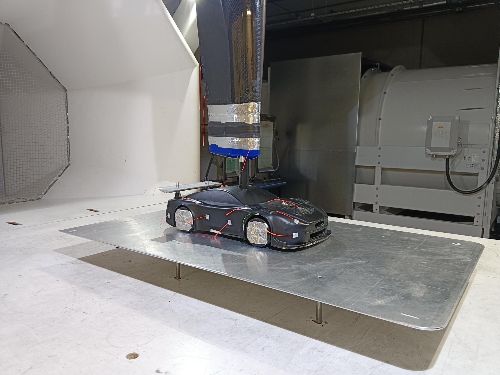

## CFD Validation

The numerical results were compared against physical wind-tunnel data.

For the open-cooling configuration with strut:

- CFD drag coefficient: 0.4305
- Wind-tunnel drag coefficient: 0.5781
- CFD lift coefficient: -0.6020
- Wind-tunnel lift coefficient: -0.5596

Differences were attributed to modelling assumptions, mesh resolution and support-strut interference.
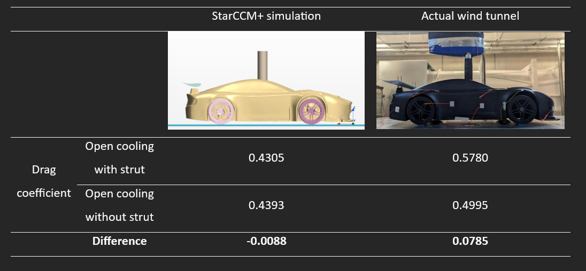

## Configuration Study

The main configurations investigated included:

1. Open cooling, support strut, spoke wheels
2. Open cooling, no strut, spoke wheels
3. Closed cooling, no strut, spoke wheels
4. Closed cooling, no strut, disk wheels
5. Optimised rear-wing configuration
### Drag Comparison

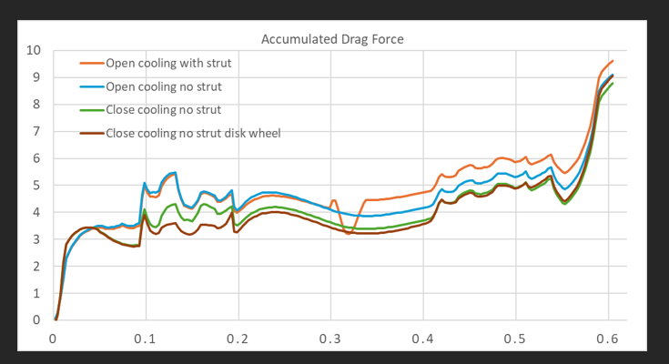

### Lift Comparison

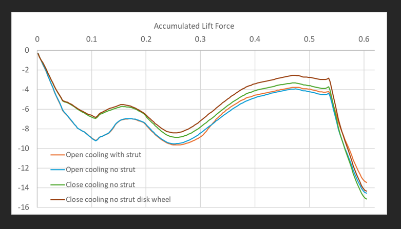

The closed-cooling and disk-wheel configurations showed improved drag characteristics compared with open-cooling configurations.

## Aerodynamic Optimisation

Rear-wing position and geometry were adjusted iteratively to improve aerodynamic balance.

The final optimised setup achieved:

- 12.2% increase in downforce
- Front/rear lift balance of approximately 41/59

This represented the best compromise between increased downforce and aerodynamic balance.
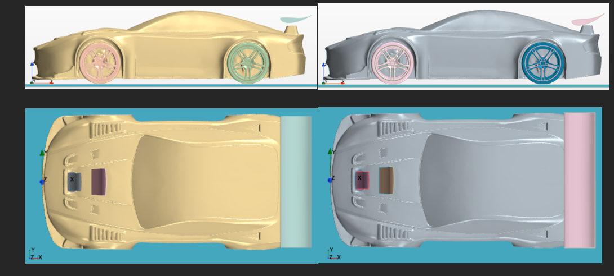

## Flow Visualisation

The CFD post-processing included:

- Pressure coefficient contours
- Wall Y+ plots
- Residual convergence
- Drag and lift coefficient monitoring
- Streamlines
- Wake behaviour
- Wing-tip and wheel vortices
- ### Pressure Distribution

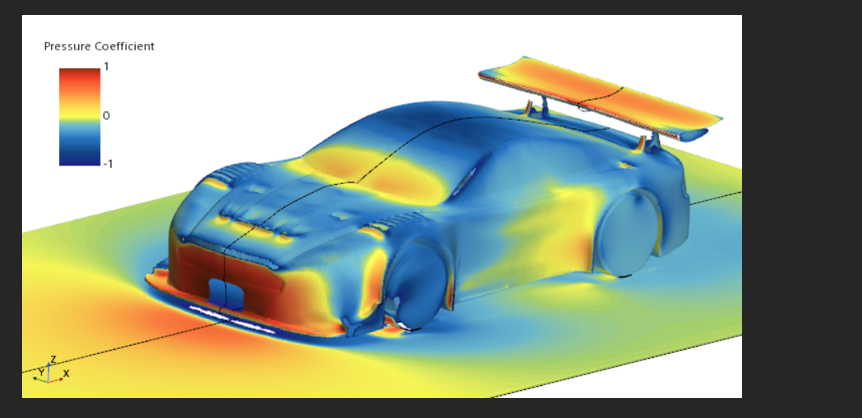

### Wake Behaviour

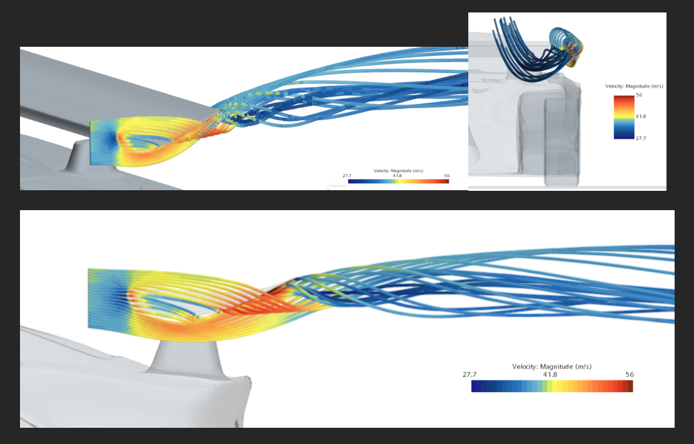

### Vortices and Flow Structure

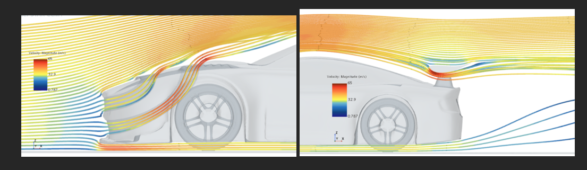

## Project Files

## Tools and Methods

- STAR-CCM+
- Computational Fluid Dynamics
- External aerodynamics
- Mesh refinement
- Mesh independence
- Turbulence modelling
- Wall Y+
- CFD convergence analysis
- Wind-tunnel validation
- Aerodynamic optimisation
- Post-processing and flow visualisation

## Project Type

Team MSc Automotive Engineering project.

## My Contribution

I contributed as a member of the four-person engineering team across:

- CFD model setup
- Mesh refinement and convergence assessment
- Configuration comparison
- Aerodynamic performance analysis
- Validation against experimental data
- Rear-wing optimisation
- Post-processing and technical documentation
